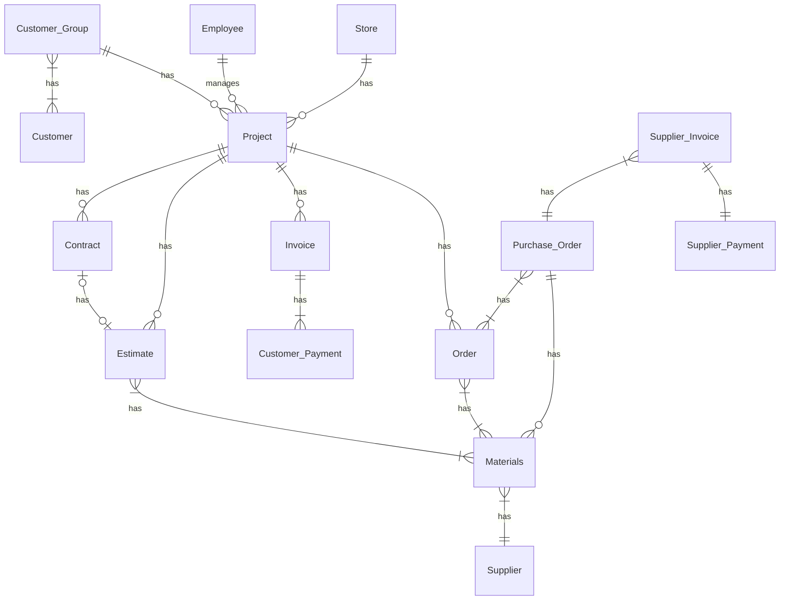

# Entity Relationship Diagram

「エンティティ＝モノ」と「リレーションシップ＝関係」の組み合わせでシステムのデータやデータ間の処理構造を設計します。

## ER図

```mermaid
erDiagram

    Customer_Group }|--|{ Customer : has
    Customer_Group ||--o{  Project : has
    Project ||--o{  Contract : has
    Project ||--o{  Estimate : has
    Project ||--o{  Invoice : has
    Project ||--o{  Order : has
    Estimate }|--|{  Materials : has
    Invoice ||--|{ Customer_Payment : has
    Contract |o--o|  Estimate : has 
    Employee ||--o{  Project : manages
    Store ||--o{  Project : has
    Order }|--|{  Materials : has
    Materials }|--|| Supplier: has

    Purchase_Order }|--|{  Order : has
    Purchase_Order ||--o{  Materials : has
    Supplier_Invoice }|--||  Purchase_Order : has
    Supplier_Invoice ||--||  Supplier_Payment : has
```

## 訳語

- [ER図](https://www.draw.io/#G1)